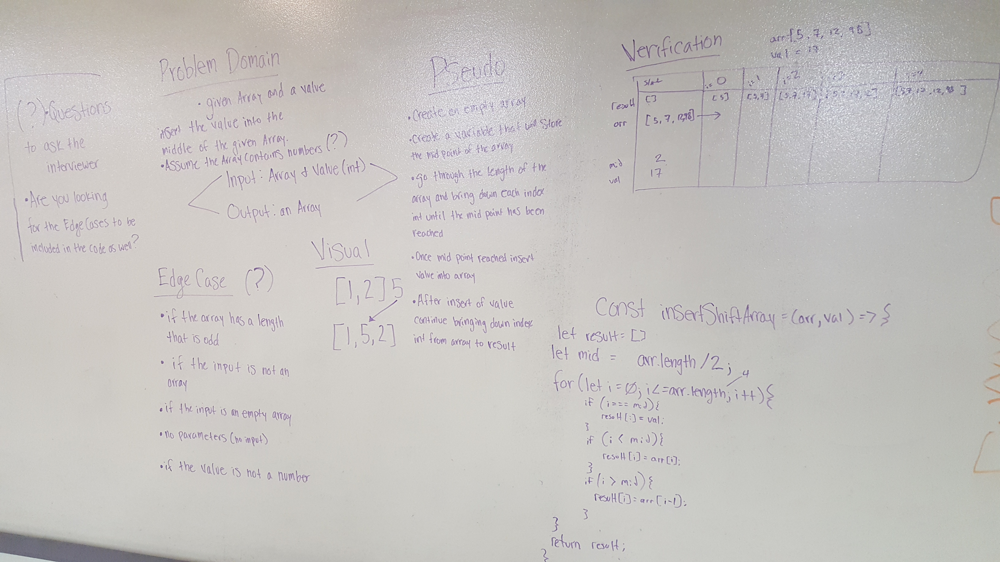

# Code Challenge 02 - Array Shift

## Author Fletcher LaRue

# Insert a value into an array and shift accordingly
As part of our whiteboarding and coding experience progression, we're solving this problem on the whiteboard.

## Challenge
Write a function called insertShiftArray which takes in an array and the value to be added. Without utilizing any of the built-in methods available to your language, return an array with the new value added at the middle index.

## Approach & Efficiency
Calculate the value of the middle element of the incoming array.

Loop over the given array, and copy each value into the new array.

When the middle index (based on calculated value) is reached, insert the provided value, and then continue inserting values into the array.

We used 3 if statements, one to check if the index is at the middle, one to check if the index is before the middle, and one to check if the index is after the middle.

If before, copy elements 1:1 from input to output array. (i)
If middle, bring the new value into the next available element. (i)
If past middle, bring the new value into the next available element. (i-1)

## Solution
<!-- Embedded whiteboard image -->
