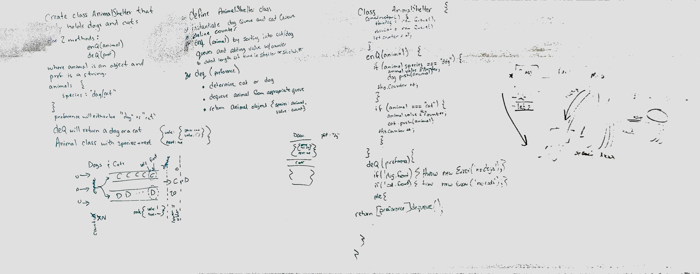

 LAB 05: Linked Lists
=================================================


### Author: Fletcher LaRue
Worked with Michael George

### Links and Resources

[](https://www.travis-ci.com/asdFletcher/data-structures-and-algorithms)

* [repo](https://github.com/asdFletcher/data-structures-and-algorithms/tree/master/code-challenges)
* [travis](https://www.travis-ci.com/asdFletcher/data-structures-and-algorithms)

--- 

---

## Feature Tasks
Create a class called AnimalShelter which holds only dogs and cats. The shelter operates using a first-in, first-out approach.
Implement the following methods:
enqueue(animal): adds animal to the shelter. animal can be either a dog or a cat object.
dequeue(pref): returns either a dog or a cat. If pref is not "dog" or "cat" then return null.

## Approach & Efficiency
<!-- What approach did you take? Why? What is the Big O space/time for this approach? -->

## API
<!-- Description of each method publicly available to your Linked List -->

## Whiteboard Solution
<!-- Embedded whiteboard image -->


---
### Files
#### `linked-list.js`
---
##### Exported Values and Methods for the following files:

#### `linked-list.js`
`linked-list.js` exports the LinkedList class, which has methods available for adding elements to the list, testing for the existence of a value, and printing the values in the list.
* `LinkedList` class
    * Methods:
        * `constructor()`
        * `add(<value>)`
        * `insert(<value>)`
        * `includes(<value>)`
        * `print()`
---

##### Using the `LinkedList` class methods:

- #### `LinkedList` `constructor()`
```JavaScript
const myList = new LinkedList();
```
* Creates a new linked list that is empty
* Accepts no arguments
* If arguments are passed in they will be ignored

- #### `LinkedList.prototype.append(<value>)`
```JavaScript
const myList = new LinkedList();
myList.append(5);
myList.append(10);
// results in HEAD: 5 --> 10
```
* appends the value to the END of the list
* Accepts 1 argument
* If the method is called with no argument, the value will default to `undefined`
* If the method is called with more than 1 argument, only the first argument will be appended

- #### `LinkedList.prototype.insert(<value>)`
```JavaScript
const myList = new LinkedList();
myList.insert(5);
myList.insert(10);
// results in HEAD: 10 --> 5
```
* Adds the value to the START of the list
* Accepts 1 argument
* If the method is called with no argument, the value will default to `undefined`
* If the method is called with more than 1 argument, only the first argument will be added

- #### `LinkedList.prototype.includes(<value>)`
```JavaScript
const myList = new LinkedList();
myList.insert(5);
myList.insert(10);

myList.includes(10); // returns true
```
* Returns `true` if the value exists in the list
* Returns `false` if the value does not exist in the list
* Loops through the list once to check for the existence of the value. Returns early if the value is found.
* Accepts 1 argument
* If the method is called with no argument, the value will default to `undefined`
* If the method is called with more than 1 argument, only the first argument will be searched for

- #### `LinkedList.prototype.print()`
```JavaScript
const myList = new LinkedList();
myList.insert(5);
myList.insert(10);

myList.includes(10); 
// log output:
// > 10
// > 5
```
* Console logs the all values in the list
* List values are logged in order starting from the start
* Each list value is logged as a separate console.log command
* This method logs the string 'undefined' if the list is empty
* Method accepts no arguments
* If the method is called with more than 1 or more arguments they are ignored

- #### `LinkedList.prototype.insertBefore(<value>,<new value>)`
```JavaScript
const myList = new LinkedList();
myList.append(5);
myList.append(10);
myList.insertBefore(10,3);
// results in HEAD: 5 --> 3 --> 10
```
* appends the `new value` to the list, before the first instance of `value`
* Accepts 2 arguments

- #### `LinkedList.prototype.insertAfter(<value>,<new value>)`
```JavaScript
const myList = new LinkedList();
myList.append(5);
myList.append(10);
myList.append(10);
myList.insertAfter(10,3);
// results in HEAD: 5 --> 10 --> 3 --> 10
```
* appends the `new value` to the list, after the first instance of `value`
* Accepts 2 arguments
---

### Testing

The linked-list folder holds all files that define the linked list class:
`/data-structures-and-algorithms/code-challenges/linked_list`

Tests are written for the LinkedList class methods and can be found here:
`/data-structures-and-algorithms/code-challenges/linked_list/__tests__/linked-list.test.js`


All testing for this class was done with Jest: 
* [Jest docs](https://jestjs.io/docs/en/getting-started)

Instructions for replicating the tests for this project are as follows:

* Clone the repo.
* Create a node runtime environment

    ```JavaScript
    npm init
    ```
    This will create a `package.json` file, a `package-lock.json` file.

* Install Jest

    ```JavaScript
    npm i jest
    ```
* Run jest
    ```JavaScript
    npm jest --verbose --coverage
    ```
    It is useful to bind this to the command:
    ```JavaScript
    npm test
    ```
    To do this, manually edit your package.json to include the following under the "scripts" attribute:
    ```Javascript
    "scripts": {
        "test": "jest --verbose --coverage",
        "test-watch": "jest --watchAll --verbose --coverage"
    }
    ```
    `test-watch` will re-run tests when the file is saved


---

### Dependencies

* jest: `npm i jest`


### Setup
#### `.env` requirements
* n/a

--- 
## Whiteboard Solution For Methods `append` `insertBefore` and `insertAfter`
<!-- Embedded whiteboard image -->


---

### To-do list
- [x] Read all of these instructions carefully
- [x] All work in the correct remo
- [x] Work on the correct branch
- [x] Work in the correct folder
- [x] Work in the correct file
- [x] Create the code
- [x] Write at least three test assertions for each method that you define.
- [x] Ensure your tests are passing before you submit your solution.
- [x] Create a pull request from your branch to your master branch
- [x] In your open pull request, leave as a comment a checklist
- [ ] Submitting your completed work to Canvas (soon)
- [ ] Merge your branch into master (soon)
