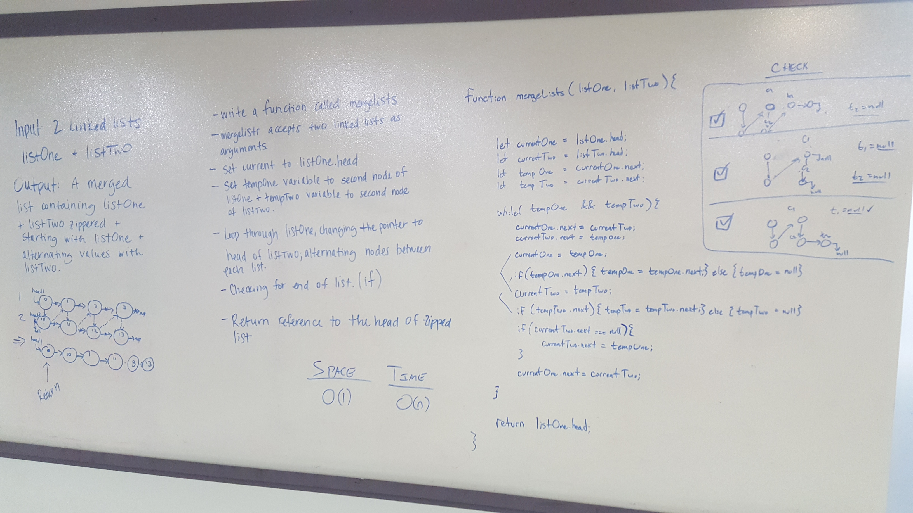

 Zipper 2 Linked Lists 
=================================================


### Author: Fletcher LaRue and Heather Cherewaty

### Links and Resources

[](https://www.travis-ci.com/asdFletcher/data-structures-and-algorithms)

* [repo](https://github.com/asdFletcher/data-structures-and-algorithms/tree/master/code-challenges/llMerge)
* [travis](https://www.travis-ci.com/asdFletcher/data-structures-and-algorithms)

--- 

---

# Implemented a merge linked list function

## Approach & Efficiency
<!-- What approach did you take? Why? What is the Big O space/time for this approach? -->

## API
#### `mergeLists`


## Whiteboard Solution

---

### Testing

The linked-list folder holds all files that define the linked list class:
`/data-structures-and-algorithms/code-challenges/linked_list`

Tests are written for the LinkedList class methods and can be found here:
`/data-structures-and-algorithms/code-challenges/linked_list/__tests__/linked-list.test.js`


All testing for this class was done with Jest: 
* [Jest docs](https://jestjs.io/docs/en/getting-started)

Instructions for replicating the tests for this project are as follows:

* Clone the repo.
* Create a node runtime environment

    ```JavaScript
    npm init
    ```
    This will create a `package.json` file, a `package-lock.json` file.

* Install Jest

    ```JavaScript
    npm i jest
    ```
* Run jest
    ```JavaScript
    npm jest --verbose --coverage
    ```
    It is useful to bind this to the command:
    ```JavaScript
    npm test
    ```
    To do this, manually edit your package.json to include the following under the "scripts" attribute:
    ```Javascript
    "scripts": {
        "test": "jest --verbose --coverage",
        "test-watch": "jest --watchAll --verbose --coverage"
    }
    ```
    `test-watch` will re-run tests when the file is saved


---

### Dependencies

* jest: `npm i jest`


### Setup
#### `.env` requirements
* n/a

--- 


---

### To-do list
- [x] Read all of these instructions carefully
- [x] All work in repo: data-structures-and-algorithms
- [x] Work on branch: ll_merge
- [x] Work in folder: llMerge
- [x] Work in file: ll-merge.js
- [x] Create the linked list function `mergeLists`
- [x] Write at least three test assertions for each method that you define.
- [x] Ensure your tests are passing before you submit your solution.
- [x] Create a pull request from your branch to your master branch
- [x] In your open pull request, leave as a comment a checklist
- [ ] Submitting your completed work to Canvas (soon)
- [ ] Merge your branch into master (soon)
