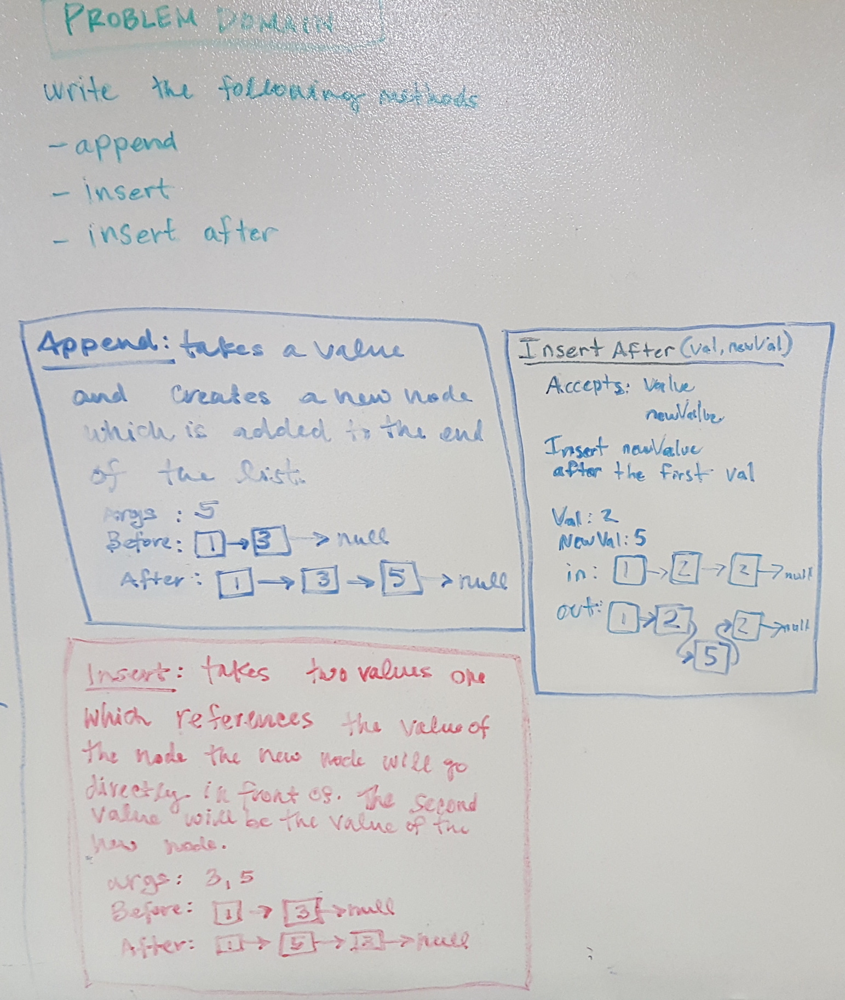
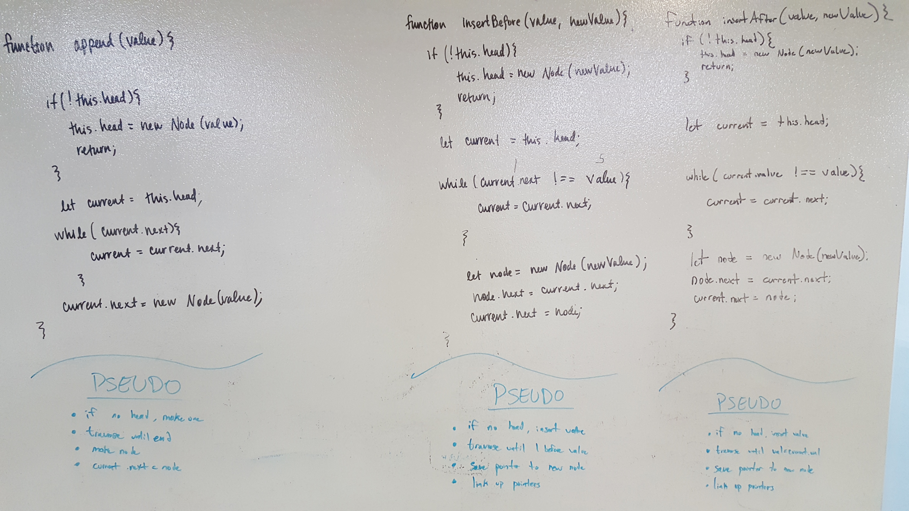
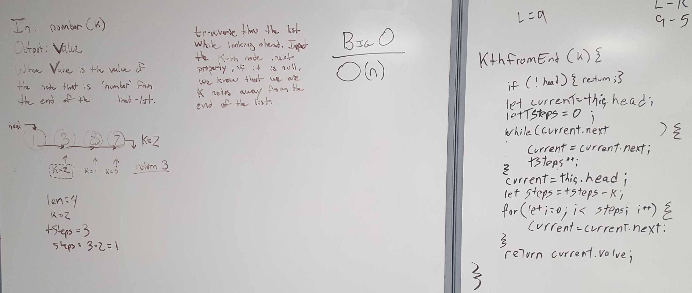

## Implementation of a `linked list` class

### Author: Fletcher LaRue

### Links and Resources

[](https://www.travis-ci.com/asdFletcher/data-structures-and-algorithms)

* [repo](https://github.com/asdFletcher/data-structures-and-algorithms/tree/master/code-challenges/linked_list)
* [travis](https://www.travis-ci.com/asdFletcher/data-structures-and-algorithms)

---

### Files
#### `linked-list.js`

---

##### Exported Values and Methods for the following files:

#### `linked-list.js`
`linked-list.js` exports the `LinkedList` class, which has methods available for adding elements to the list, testing for the existence of a value, and printing the values in the list.

* `LinkedList` class
    * Methods:
        * `constructor()`
        * `insert(<value>)`
        * `append(<value>)`
        * `includes(<value>)`
        * `print()`
        * `insertBefore(<value>, <new value>)`
        * `insertAfter(<value>, <new value>)`
        * `kthFromEnd(<number k>)`
---

##### Using the `LinkedList` class methods:

- #### `LinkedList` `constructor()`
```JavaScript
const myList = new LinkedList();
```
* Creates a new linked list that is empty
* Accepts no arguments
* If arguments are passed in they will be ignored

- #### `LinkedList.prototype.insert(<value>)`
```JavaScript
const myList = new LinkedList();
myList.insert(5);
myList.insert(10);
// results in HEAD: 10 --> 5
```
* Adds the value to the START of the list
* Accepts 1 argument
* If the method is called with no argument, the value will default to `undefined`
* If the method is called with more than 1 argument, only the first argument will be added

- #### `LinkedList.prototype.append(<value>)`
```JavaScript
const myList = new LinkedList();
myList.append(5);
myList.append(10);
// results in HEAD: 5 --> 10
```
* appends the value to the END of the list
* Accepts 1 argument
* If the method is called with no argument, the value will default to `undefined`
* If the method is called with more than 1 argument, only the first argument will be appended


- #### `LinkedList.prototype.includes(<value>)`
```JavaScript
const myList = new LinkedList();
myList.insert(5);
myList.insert(10);

myList.includes(10); // returns true
```
* Returns `true` if the value exists in the list
* Returns `false` if the value does not exist in the list
* Loops through the list once to check for the existence of the value. Returns early if the value is found.
* Accepts 1 argument
* If the method is called with no argument, the value will default to `undefined`
* If the method is called with more than 1 argument, only the first argument will be searched for


- #### `LinkedList.prototype.print()`
```JavaScript
const myList = new LinkedList();
myList.insert(5);
myList.insert(10);

myList.includes(10); 
// log output:
// > 10
// > 5
```
* Console logs the all values in the list
* List values are logged in order starting from the start
* Each list value is logged as a separate console.log command
* This method logs the string 'undefined' if the list is empty
* Method accepts no arguments
* If the method is called with more than 1 or more arguments they are ignored

- #### `LinkedList.prototype.insertBefore(<value>,<new value>)`
```JavaScript
const myList = new LinkedList();
myList.append(5);
myList.append(10);
myList.insertBefore(10,3);
// results in HEAD: 5 --> 3 --> 10
```
* appends the `new value` to the list, before the first instance of `value`
* Accepts 2 arguments

- #### `LinkedList.prototype.insertAfter(<value>,<new value>)`
```JavaScript
const myList = new LinkedList();
myList.append(5);
myList.append(10);
myList.append(10);
myList.insertAfter(10,3);
// results in HEAD: 5 --> 10 --> 3 --> 10
```
* appends the `new value` to the list, after the first instance of `value`
* Accepts 2 arguments

- #### `LinkedList.prototype.kthFromEnd(<number k>)`
```JavaScript
const myList = new LinkedList();
myList.append(5);
myList.append(10);
myList.append(3);
myList.append(1);
// results in HEAD: 5 --> 10 --> 3 --> 1
myList.kthFromEnd(2);
// returns 10
```
* Given a number k, returns the value of the node that is k from the end of the list
* k = 0 returns the last element in the list
* k = 1 returns the 2nd to last element in the list
* Accepts 1 argument, k
* returns undefined if k is larger than the length of the list
* returns undefined if the list is empty
* returns undefined if k is not provided

---

### Testing

Tests are written for the class methods and can be found in the `__tests__` folder.

All testing for this class was done with Jest: 
* [Jest docs](https://jestjs.io/docs/en/getting-started)

Instructions for replicating the tests for this project are as follows:

* Clone the repo from github.
* Install dependencies  (including `Jest`)

    ```
    npm i
    ```

* Run `Jest`
    ```
    npm jest --verbose --coverage
    ```
    This command is bound to:
    ```
    npm test
    ```
    The binding for this is in the package.json file:
    ```Javascript
    "scripts": {
        "test": "jest --verbose --coverage",
        "test-watch": "jest --watchAll --verbose --coverage"
    }
    ```
    `test-watch` will re-run tests when the file is saved

---

### Dependencies

* jest: `npm i jest`


### Setup
#### `.env` requirements
* n/a

--- 
## Whiteboard Solution For Methods `append` `insertBefore` and `insertAfter`
<!-- Embedded whiteboard image -->



## Whiteboard Solution For Methods `kthFromEnd`
<!-- Embedded whiteboard image -->


