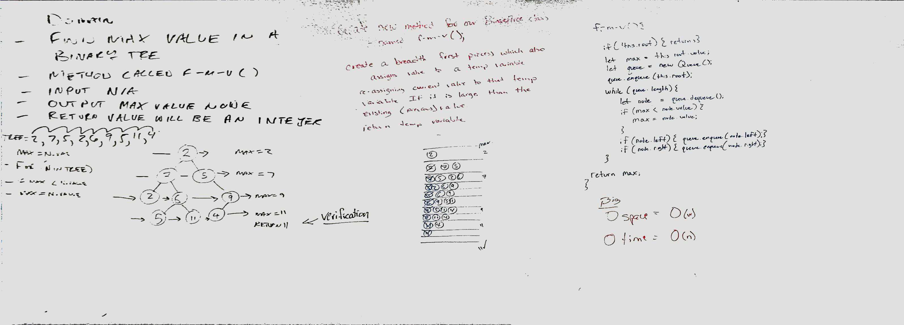

 Lab 15
=================================================

### Trees

### Author: Fletcher LaRue

### Links and Resources

[](https://www.travis-ci.com/asdFletcher/data-structures-and-algorithms)

* [repo](https://github.com/asdFletcher/data-structures-and-algorithms/tree/master/code-challenges/llMerge)
* [travis](https://www.travis-ci.com/asdFletcher/data-structures-and-algorithms)

---

---

# Implemented a tree class
```js
// tree:
//       (1)
//       / \
//     (3) (5)
//    /  \    \
// (2)   (6)  (15)
```
---
### Files
#### `tree.js`

---
##### Exported Values and Methods for the following files:

#### `tree.js`
`tree.js` exports the `Tree` and `Node` class, which have methods for adding and removing elements that follow the traditional data structure scheme for trees. Including a `preOrder`, `postOrder`, and `inOrder` traversal.


* `Tree` class
    * Methods:
        * `constructor()`
        * `preOrder()`
        * `postOrder()`
        * `inOrder()`
        * `add()`
        * `contains()`

---

##### Using the `Tree` class methods:

- #### `Tree` `constructor()`
```JavaScript
const myTree = new Tree();
```
* Creates a new tree that is empty
* Accepts no arguments
* If arguments are passed in they will be ignored
* The `root` value of a new empty tree is `null`

- #### `Tree.prototype.add(<value>)`
```JavaScript
const myTree = new Tree();
myTree.add(5);
myTree.add(10);
```
* Adds the value to the tree
* Accepts 1 argument
* If the method is called with no argument, the value will default to `undefined`
* If the method is called with more than 1 argument, only the first argument will be accepted


---

### Testing

All testing for this class was done with Jest: 
* [Jest docs](https://jestjs.io/docs/en/getting-started)

Instructions for replicating the tests for this project are as follows:

* Clone the repo.
* Create a node runtime environment

    ```JavaScript
    npm init
    ```
    This will create a `package.json` file, a `package-lock.json` file.

* Install Jest

    ```JavaScript
    npm i jest
    ```
* Run jest
    ```JavaScript
    npm jest --verbose --coverage
    ```
    It is useful to bind this to the command:
    ```JavaScript
    npm test
    ```
    To do this, manually edit your package.json to include the following under the "scripts" attribute:
    ```Javascript
    "scripts": {
        "test": "jest --verbose --coverage",
        "test-watch": "jest --watchAll --verbose --coverage"
    }
    ```
    `test-watch` will re-run tests when the file is saved


---

### Dependencies

* jest: `npm i jest`


### Setup
#### `.env` requirements
* n/a

--- 

## Additional related functions

# Find the Maximum Value in a Binary Tree


## Challenge
Write a function called `find-maximum-value` which takes binary tree as its only input. Without utilizing any of the built-in methods available to your language, return the maximum value stored in the tree. You can assume that the values stored in the Binary Tree will be numeric.

## Approach & Efficiency
We used a breadth first search with a queue, and enqueued values when they were encountered, starting with the root. The nodes were enqueued in the order they were encountered , left to right. When a tree node in the queue was evaluated it was dequeued, and if it was larger than the max value encountered so far, then max value was updated. This was in a while loop , which ran until the queue was empty.

The speed of this is O(n) , since it has to traverse every node, and it looks at each node once.

The space of this is O(w) where width is the maximum number of nodes 'across' the tree. Since this is a binary tree, and the width is related to n as follows:
h = 1, w = 2
h = 2, w = 4
h = 3, w = 8
h = 4, w = 16

So w is h^2. 

And n is related to w as follows:
w = 1, n = 1
w = 2, n = 2 + all prior
w = 3, n = 3 + all prior
w = 4, n = 4 + all prior

so n = w + w-1 + w-2 ... + 1

which is just w^2 / 2


## Solution



