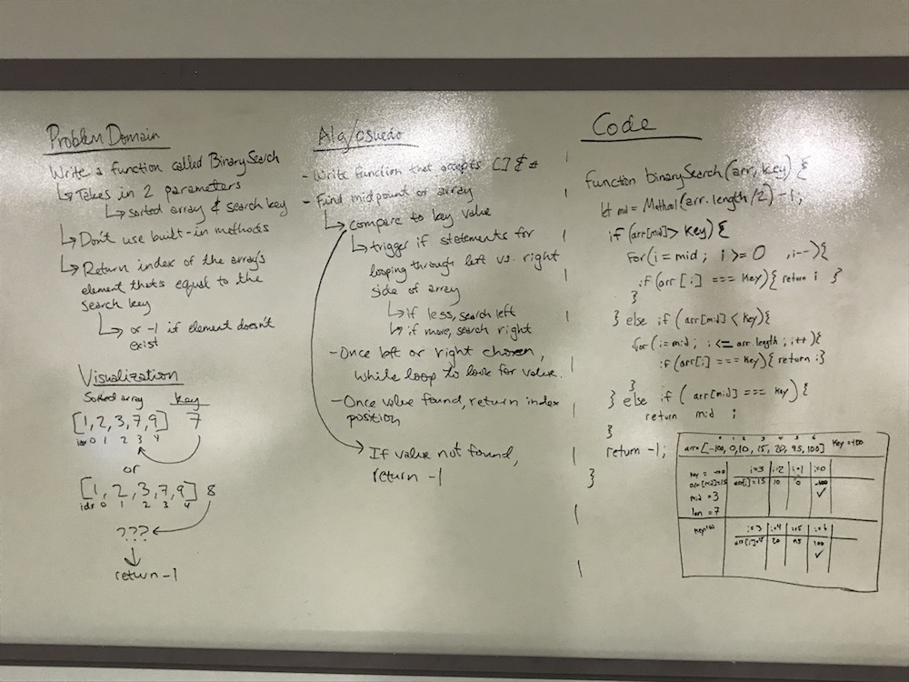

# Code Challenge 01 - Array Binary Search

## Authors
Fletcher LaRue and Becca Lee

# Binary Search
<!-- Short summary or background information -->
Perform a binary search.

## Challenge
<!-- Description of the challenge -->
Write a function called BinarySearch which takes in 2 parameters: a sorted array and the search key. Without utilizing any of the built-in methods available to your language, return the index of the array’s element that is equal to the search key, or -1 if the element does not exist.

## Approach & Efficiency
<!-- What approach did you take? Why? What is the Big O space/time for this approach? -->

For this challenge we split the array in half, and iterated using a for loop over the remaining half. This is not quite the optimal solution, as it will run slower (I think O(n)) than a true binary search (I think O(log(n)). However, due to time constraints we chose to get a working solution quickly. If the interviewer asked us to optimize this, we would pursue this further.

We had a variety of syntax errors: let infront of i in the for loops, missing semicolons, etc. But the guts of the algorithm is valid.

## Solution
<!-- Embedded whiteboard image -->

